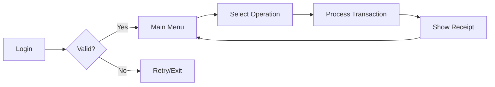

# 💳 ATM Simulation System

<div align="center">


**A realistic ATM simulation with secure authentication and transaction management**

[Features](#-features) • [Installation](#️-installation) • [Usage](#-usage) • [Demo](#-demo)

</div>

---

## 📋 Overview

An interactive **ATM Simulation System** that replicates real-world ATM operations. Built entirely with Core Java, this project demonstrates secure user authentication, transaction processing, and professional error handling using OOP principles.

## ✨ Features

| Feature | Description |
|---------|-------------|
| 🔐 **Secure Authentication** | User ID and PIN-based login system |
| 💰 **Balance Inquiry** | Real-time account balance checking |
| 💸 **Cash Withdrawal** | Secure withdrawal with balance validation |
| 💵 **Cash Deposit** | Instant deposit with confirmation |
| ✅ **Input Validation** | Comprehensive error checking |
| 🔄 **Session Management** | Secure login/logout functionality |
| ⚡ **Fast Transactions** | Optimized performance with HashMap |

## 🧠 Core Concepts Demonstrated

<table>
<tr>
<td>

**OOP Principles**
- ✅ Encapsulation
- ✅ Data Security
- ✅ Method Abstraction

</td>
<td>

**Java Features**
- ✅ Collections (HashMap)
- ✅ Exception Handling
- ✅ Input Validation
- ✅ Control Flow

</td>
</tr>
</table>

## 🛠️ Technology Stack

```text
Language    : Java (JDK 8+)
IDE Options : IntelliJ IDEA | Eclipse | VS Code
Data Store  : HashMap (In-memory storage)
```

## ⚙️ Installation

### Prerequisites
- Java Development Kit (JDK) 8 or higher
- Command line or Java IDE

### Setup Steps

```bash
# 1. Clone the repository
git clone https://github.com/srikanth-thirumani/ATM-Simulation-System.git

# 2. Navigate to project directory
cd ATM-Simulation-System

# 3. Compile the Java file
javac ATMSimulationSystem.java

# 4. Run the application
java ATMSimulationSystem
```

## 🎯 Usage

### Default Credentials

```
┌──────────────────────────────┐
│   Test User Credentials      │
├──────────────────────────────┤
│  User ID: user1              │
│  PIN:     1234               │
│  Balance: ₹5000.00           │
└──────────────────────────────┘
```

### ATM Menu Options

```
╔════════════════════════════════════════╗
║         ATM Simulation Menu           ║
╠════════════════════════════════════════╣
║  1. Check Balance                     ║
║  2. Deposit Cash                      ║
║  3. Withdraw Cash                     ║
║  4. Exit                              ║
╚════════════════════════════════════════╝
```

### Transaction Flow



## 📸 Demo

```console
╔════════════════════════════════════════╗
║   Welcome to ATM Simulation System    ║
╚════════════════════════════════════════╝

Enter User ID: user1
Enter PIN: ****

✓ Login Successful!

--- ATM Menu ---
1. Check Balance
2. Deposit Cash
3. Withdraw Cash
4. Exit

Enter your choice: 1

╔════════════════════════════════════════╗
║        BALANCE INQUIRY RECEIPT        ║
╠════════════════════════════════════════╣
║  User ID:  user1                      ║
║  Balance:  ₹5,000.00                  ║
║  Date:     2025-11-04 14:30:45        ║
╚════════════════════════════════════════╝

Enter your choice: 2
Enter deposit amount: ₹2000
✓ Successfully deposited ₹2,000.00
Current Balance: ₹7,000.00

Enter your choice: 3
Enter withdrawal amount: ₹1000
✓ Cash dispensed: ₹1,000.00
Remaining Balance: ₹6,000.00
```

## 📂 Project Structure

```
ATM-Simulation-System/
│
├── 📄 ATMSimulationSystem.java        # Main application
├── 📄 ATMUser.java                    # User model class
├── 📄 ATMOperations.java              # Business logic
├── 📖 README.md                       # Documentation
└── 📜 LICENSE                         # MIT License
```

## 🔒 Security Features

- ✅ PIN masking during input
- ✅ Invalid login attempt tracking
- ✅ Balance verification before withdrawal
- ✅ Secure session management
- ✅ Input sanitization

## 💡 Key Highlights

### Exception Handling
```java
✓ InvalidAmountException
✓ InsufficientBalanceException
✓ InvalidCredentialsException
✓ NullPointerException handling
```

### Validation Rules
- Minimum withdrawal: ₹100
- Maximum withdrawal: ₹50,000 per transaction
- Deposit limit: ₹2,00,000 per transaction
- Account balance cannot be negative

## 🚀 Future Enhancements

- [ ] Database integration for persistent storage
- [ ] Multiple account support per user
- [ ] Transaction history with timestamps
- [ ] Mini-statement generation
- [ ] PIN change functionality
- [ ] Card blocking after failed attempts
- [ ] Receipt printing simulation
- [ ] GUI implementation

## 🎓 Learning Outcomes

By exploring this project, you'll understand:

- ✅ User authentication mechanisms
- ✅ Secure transaction processing
- ✅ HashMap for efficient data retrieval
- ✅ Exception handling best practices
- ✅ Input validation techniques
- ✅ Console-based UI design

## 🤝 Contributing

Contributions are welcome! To contribute:

1. Fork the repository
2. Create your feature branch (`git checkout -b feature/NewFeature`)
3. Commit your changes (`git commit -m 'Add NewFeature'`)
4. Push to the branch (`git push origin feature/NewFeature`)
5. Open a Pull Request

## 👨‍💻 Author

**Thirumani Srikanth**

[](https://linkedin.com/in/your-profile)
[](https://github.com/your-username)
[](https://your-portfolio.com)
[](mailto:your.email@example.com)

## 📊 Project Stats


## 📄 License

This project is licensed under the MIT License - see the [LICENSE](LICENSE) file for details.

## ⭐ Show Your Support

If this project helped you learn Java concepts, please give it a ⭐️!

---

<div align="center">

**Built with ☕ and 💻 by Thirumani Srikanth**

*"Code is like humor. When you have to explain it, it's bad." – Cory House*

</div>
